<picture>
  <source media="(prefers-color-scheme: dark)" srcset="profile-dark.svg">
  <source media="(prefers-color-scheme: light)" srcset="profile-light.svg">
  
</picture>

  

<a href="https://github.com/AlexYrlv/gpthub">
  <picture>
    <source media="(prefers-color-scheme: dark)" srcset="https://github-readme-stats.vercel.app/api/pin/?username=AlexYrlv&repo=gpthub&theme=github_dark&hide_border=true&show_owner=true">
    
  </picture>
</a>

  

  
  
  

